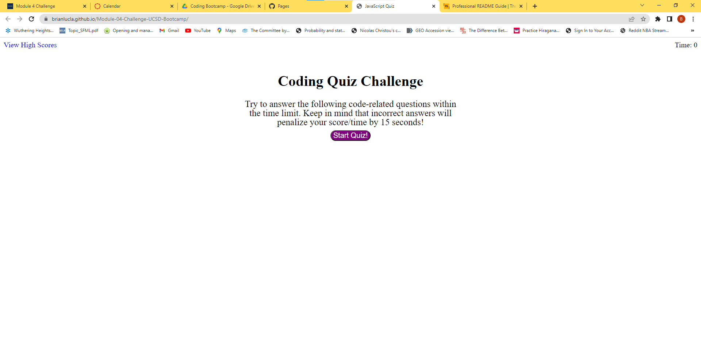

# Coding Quiz

## Description

We were motivated to create a coding quiz for up and coming coders to test their knowledge with. We built this project to help coders learn about the material they've been covering in classes. From this project, I learned how to store data in local storage, and use JavaScript to take in user inputs.
## Installation

N/A

## Usage

Press the start button to begin the quiz. Click the answer choices to either gain or lose points based on correctness. If your answer is incorrect, time will be deducted from the timer. If the timer reaches zero or the user has made it to the end of the quiz, the user's score will be displayed as well as a text input box to enter their initials. If the user presses the submit button, they will be redirected to a page with a list of their scores and the option to go back to the quiz or clear their scores from the page.

Link to deployed website: https://brianlucla.github.io/Module-04-Challenge-UCSD-Bootcamp/

Screenshots of application:

## Credits

N/A

## License

Please refer to the License provided on the github repository.

